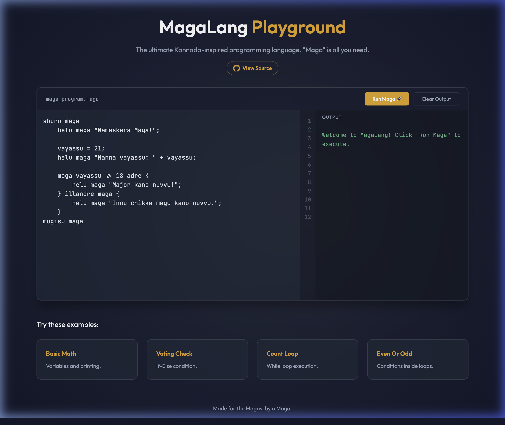

# 🚀 MagaLang Playground

MagaLang is a Kannada-inspired, lightweight programming language designed for playful learning and expression. Built for the Magas, by a Maga.

**[▶ Try the Live Playground](https://nvkudva.github.io/magalang/)**



## ✨ Features
- **Kannada Keywords**: Familiar terms like `shuru`, `mugisu`, `helu`, and `maga`.
- **Lightweight Interpreter**: A custom-built JavaScript interpreter that runs directly in the browser.
- **Glassmorphic UI**: A premium, modern editor experience with dark mode and vibrant accents.
- **Interactive Playground**: Write, run, and experiment with code in real-time.

## 🛠️ Language Reference

### Basic Structure
Every program must start with `shuru maga` and end with `mugisu maga`.
```maga
shuru maga
    // Your code here
mugisu maga
```

### Keywords
| Keyword | Meaning |
|---------|---------|
| `shuru maga` | Program Start |
| `mugisu maga` | Program End |
| `helu maga` | Print to Output |
| `maga` | If / Expression evaluation |
| `adre` | Then |
| `illandre maga` | Else / Else If |
| `repeat madu maga` | Loop (While) |

### Examples
#### Variables & Printing
```maga
shuru maga
    a = 10;
    b = 20;
    helu maga "Sum: " + (a + b);
mugisu maga
```

#### Conditionals
```maga
shuru maga
    vayasu = 18;
    maga vayasu >= 18 adre {
        helu maga "Vote hakabahudu maga!";
    } illandre maga {
        helu maga "Kaayi maga!";
    }
mugisu maga
```

#### Loops
```maga
shuru maga
    i = 1;
    repeat madu maga i <= 5 {
        helu maga "Count: " + i;
        i = i + 1;
    }
mugisu maga
```

## 🚀 Getting Started
1. Clone this repository.
2. Open `index.html` in any modern web browser or use a local server like `http-server`.
3. Start writing some MagaLang!

## 🧪 Development
To contribute or modify the interpreter, check out `maga-interpreter.js`. The logic is modular and easy to extend.

---
Made with ❤️ by nvkudva
